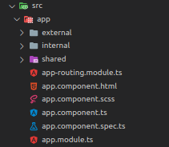

<h1 align="center">
    
</h1>
 
<h1> Angular Boilerplate Material Lazy </h1>

<p align="left">
   <a href="https://github.com/danieljpgo">
      
   </a>
   
   <a href="https://github.com/danieljpgo/angular-boilerplate-material-lazy/graphs/contributors">
      
   </a>
  
</p>

> Reducing how much you need to think about when starting a project. :building_construction:

----

<p align="center">
   <a href="#memo-project">Project</a>&nbsp;&nbsp;&nbsp;|&nbsp;&nbsp;&nbsp;
   <a href="#card_index_dividers-structure">Structure</a>&nbsp;&nbsp;&nbsp;|&nbsp;&nbsp;&nbsp;
   <a href="#man_technologist-technologies">Technologies</a>&nbsp;&nbsp;&nbsp;|&nbsp;&nbsp;&nbsp;
   <a href="#runner-getting-started">Getting Started</a>&nbsp;&nbsp;&nbsp;|&nbsp;&nbsp;&nbsp;
   <a href="#page_with_curl-license">License</a>
</p>

## :memo: Project
#####:construction: This project is outdated ~~(Angular 8.0)~~, use only the structure and concepts.


Since I worked with **Angular** at the time. I developed this **boilerplate**, which is basically the structure that the project must follow, a **structure of modules**, implementation of **lazy loading** based on routes, **shared module** and navigation component with **Angular Material** to accelerate the start of projects.

## :card_index_dividers: Structure
The main structure that the project implements, is the idea of ​​separating the **internal part** and the **external part** of an application, ~~(but what is the internal part and the external part?)~~.

The **internal part**, is everything that needs to be authenticated to be accessed and what does not need authentication, is the **external part**. So, if the user is already authenticated, he should not download the entire **external part** of the application, right? (~~yes~~). So it’s cool to divide the application into these two parts

Therefore, dividing the application into the following scopes:
- **External Module**
- **Internal Module**
- **Shared Module**, ~~if you don't know what it is, follow the [link](https://angular.io/guide/sharing-ngmodules).~~
- ~~**Services**, if necessary.~~ 

Becoming something like this:


The code for your `app-routing.module.ts` will look something like:

```ts
...

const routes: Routes = [
  // External routing
  {
    path: 'autenticacao',
    loadChildren: () => import('./external/external.module').then(mod => mod.ExternalModule)
  },
  // Internal routing
  {
    path: '',
    loadChildren: () => import('./internal/internal.module').then(mod => mod.InternalModule)
  }
];

@NgModule({
  imports: [
    RouterModule.forRoot(routes, {
      useHash: true,
      enableTracing: true
    })
  ],
  exports: [RouterModule]
})
export class AppRoutingModule { }
```
#### External Module
... :construction: under construction

## :man_technologist: Technologies
The main technologies used to develop the project were:
- [Angular](https://angular.io/)
- [Angular Material](https://material.angular.io/)
- [RxJS](https://rxjs.dev/guide/overview)
- [Typescript](https://www.typescriptlang.org/)

## :runner: Getting Started
... :construction: under construction

<!-- First, make sure you have **[Node](https://nodejs.org/en/)**, then clone the project with:
```
git clone https://github.com/danieljpgo/angular-boilerplate-material-lazy.git
```

With  **[npm](https://nodejs.org/en/knowledge/getting-started/npm/what-is-npm/)**, install dependencies:
```
npm install
```
In order to **start** the application, execute:
```
ng serve
``` -->

## :page_with_curl: License
This project is under the [MIT license](https://github.com/danieljpgo/angular-boilerplate-material-lazy/blob/master/LICENSE).
<div>Released in 2019.</div>
<div>README update in 2020.</div>

Developed by [Daniel Jorge](https://github.com/danieljpgo)